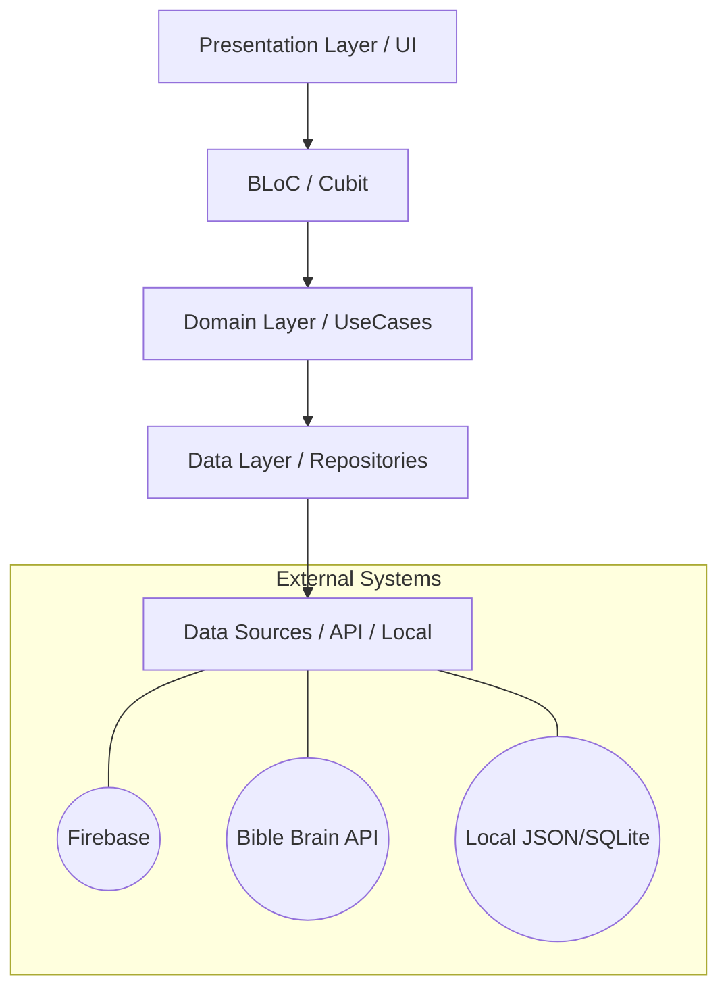

# ቅዱስ መጽሐፍ  (Holy Bible) 📖✨

**ቅዱስ መጽሐፍ** is a premium, high-performance Amharic Bible application built with Flutter. It focuses on delivering a serene and spiritual reading experience combined with professional human-voice audio synchronization.

---

## ✨ Key Features

### 🎧 Professional Audio & Background Playback
- **Real Human Voice**: Integrated with the **Bible Brain (FCBH)** API to provide natural Amharic audio recordings (AMHNIV).
- **Background Support**: Continue listening even when the app is in the background or the screen is locked.
- **System Notification Controls**: Manage playback from your device's media controller with full metadata (Book & Chapter).
- **Verse Sync**: Visual highlighting that follows the audio playback in real-time.
- **Auto-Scroll**: The reader automatically scrolls to keep the active verse in view during audio playback.

### 📖 Advanced Reading Experience
- **Premium Typography**: Uses the **Noto Serif Ethiopic** font for optimal legibility of Ge'ez characters.
- **Saba Theme System**: Beautifully crafted Light and Dark modes with glassmorphism and subtle micro-animations.
- **Bookmarks & Highlights**: Save your favorite verses and personalize your reader.
- **Library & Navigation**: Seamless navigation between Old and New Testaments with intuitive version and book selectors.

### 🔍 Powerful Search
- **Mode Selection**: Search by "Exact Words" or "Contains" to find precisely what you need.
- **Contextual Results**: Real-time result counts and filtering by testament.
- **Version Selector**: Easily switch between Amharic versions in the search view.

---

## 🏗️ Architecture

The project follows **Clean Architecture** principles and uses the **BLoC (Business Logic Component)** pattern for state management. This ensures a highly testable, scalable, and maintainable codebase.



---

## 🛠️ Technology Stack

- **Framework**: [Flutter](https://flutter.dev)
- **State Management**: [flutter_bloc](https://pub.dev/packages/flutter_bloc)
- **Audio Engine**: [just_audio](https://pub.dev/packages/just_audio) & [just_audio_background](https://pub.dev/packages/just_audio_background)
- **Database/Cloud**: [Firebase](https://firebase.google.com) (Auth, Firestore)
- **Design System**: Vanilla CSS with custom theme tokens.
- **Typography**: [Google Fonts (Noto Serif Ethiopic)](https://fonts.google.com/specimen/Noto+Serif+Ethiopic)

---

## 🚀 Getting Started

### Prerequisites
- Flutter SDK (latest stable)
- A Firebase project with `google-services.json` (Android) and `GoogleService-Info.plist` (iOS).
- A **Bible Brain API Key** (required for audio streaming).

### Installation
1. Clone the repository:
   ```bash
   git clone https://github.com/yourusername/bible.git
   ```
2. Install dependencies:
   ```bash
   flutter pub get
   ```
3. Add your API keys in `lib/core/services/bible_brain_service.dart`.
4. Run the app:
   ```bash
   flutter run
   ```

---

## 📄 License
This project is licensed under the MIT License - see the [LICENSE](LICENSE) file for details.

---

Made with ❤️ for the Amharic speaking community.
